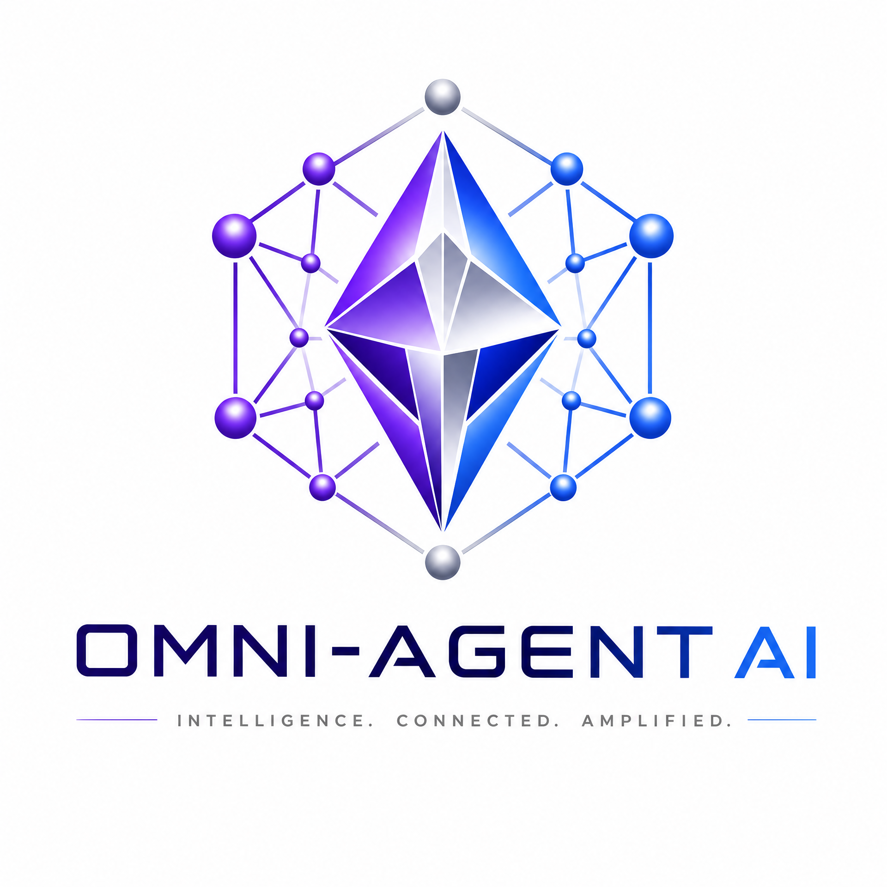
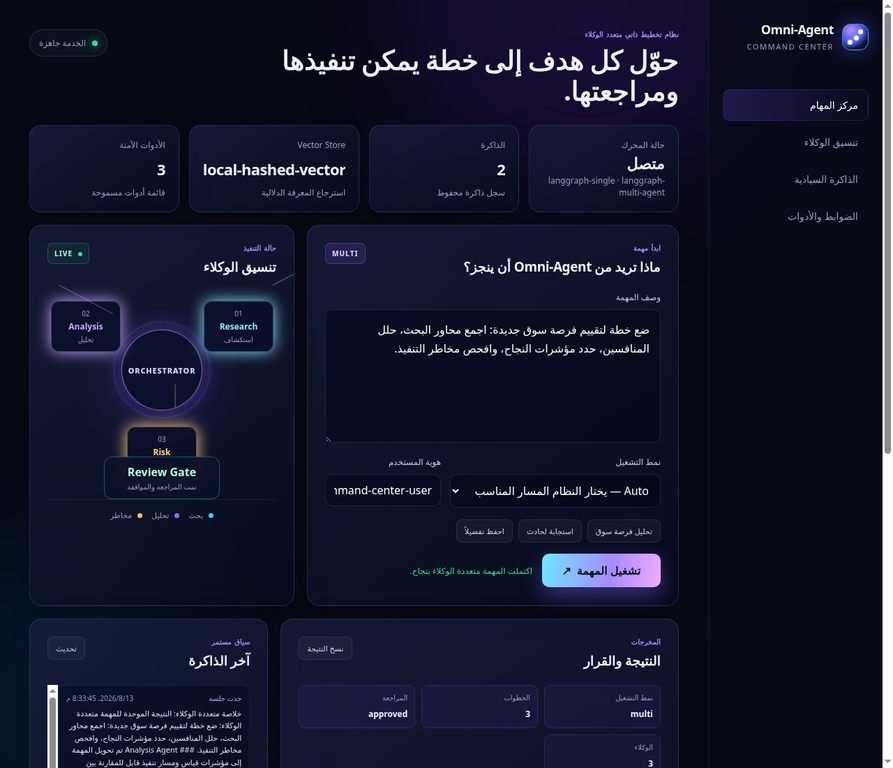
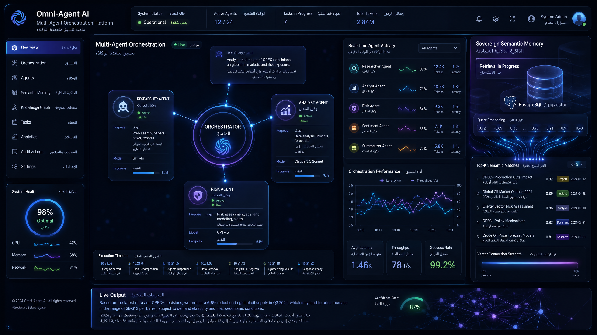
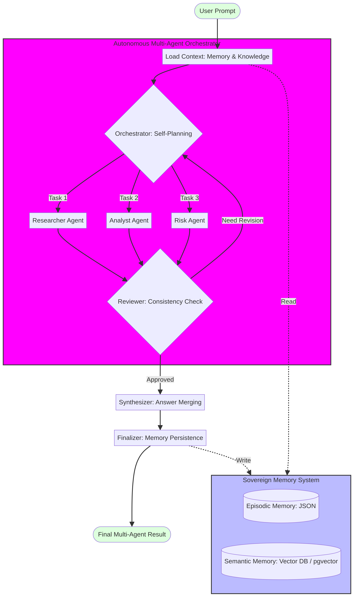

# 💎 Omni-Agent AI v3.0

<p align="center">
  
</p>

<p align="center">
  
  
  
  
  
</p>

---

## ⚡ Command Center: المنتج الحقيقي

لم يعد المشروع مجرد API أو صور تصورية. أضيفت لوحة تحكم تفاعلية حقيقية تُخدَم من المسار `/` وتعمل مباشرة مع محرك LangGraph. يمكن للمستخدم إدخال مهمة، اختيار نمط التشغيل، مشاهدة وكلاء البحث والتحليل والمخاطر، قراءة النتيجة الموحدة، ومراجعة ذاكرة الجلسة والأدوات المسموح بها.

<p align="center">
  
  <br>
  <i>واجهة Command Center متصلة بمحرك Omni-Agent الحقيقي وليست صورة واجهة فقط.</i>
</p>

| ما يراه المستخدم | القيمة العملية |
| --- | --- |
| اختيار Auto أو Single أو Multi-Agent | تحويل المهمة البسيطة أو المعقدة إلى مسار تشغيل مناسب دون إعدادات تقنية معقدة |
| مخطط الوكلاء وحالة المراجعة | شفافية: يظهر من شارك في المهمة وهل تمت الموافقة على المخرجات |
| لوحة الذاكرة | يوضح ما يتذكره النظام في الجلسة والبيانات الدلالية ذات الصلة |
| سجل الأدوات | يوضح أن التنفيذ مقيد بأدوات مسموحة وبوابة تأكيد للأفعال الخارجية |
| **Data Analysis Lab** | رفع CSV وتحليل هيكله وعلاقاته وجودته عبر ثلاثة وكلاء محليين، من دون حفظ محتوى الملف |

## 🎨 The Multi-Agent Evolution & Sovereign Memory

<p align="center">
  
  <br>
  <i>Conceptual Dashboard: Multi-Agent Orchestration, Sovereign Semantic Memory (pgvector), and Real-time Task Decomposition.</i>
</p>

---

**Omni-Agent AI** هو نظام متطور لوكلاء الذكاء الاصطناعي المستقلين، يعتمد على بنية **التخطيط الذاتي متعدد الوكلاء (Multi-Agent Planning)**. النسخة 3.2 تنقل المشروع من مجرد وكيل واحد إلى "أوركسترا" من الوكلاء المتخصصين الذين يعملون بتناغم لحل المهام المعقدة وتحليل ملفات CSV، مع دعم كامل لقواعد البيانات المتجهية لضمان ذاكرة سيادية دائمة ودقيقة.

## 🌟 الميزات المتقدمة (نسخة 3.2)

| الميزة | الوصف التقني | الفائدة |
| --- | --- | --- |
| **Multi-Agent Orchestrator** | تنسيق مهام بين وكلاء (Researcher, Analyst, Risk Manager) عبر LangGraph | حل المهام المعقدة التي تتطلب بحثاً وتحليلاً ومراجعة مخاطر متوازية |
| **Auto-Planning Mode** | اكتشاف تلقائي لصعوبة المهمة والتحويل بين المسار الفردي والمتعدد | توفير الموارد للمهام البسيطة واستخدام القوة الكاملة للمهام المعقدة |
| **Vector Semantic Memory** | محرك ذاكرة متجهي يدعم pgvector و Local Hashed Vectors | استرجاع فائق السرعة والدقة للحقائق والتفضيلات الشخصية |
| **Self-Correction Loop** | حلقة مراجعة ونقد ذاتي (Reflexion) قبل تسليم النتيجة النهائية | ضمان أعلى مستويات الدقة وتقليل الهلوسة البرمجية |
| **Production Ready** | دعم كامل لـ Docker، PostgreSQL، وواجهة API متطورة | جاهزية تامة للنشر في بيئات الإنتاج السحابية |
| **Data Analysis Lab** | وكلاء استكشاف وInsight وجودة لملفات CSV | يحول ملف البيانات إلى ملخص وتنبيهات قابلة للتنفيذ داخل الواجهة |

---

## 🏗️ Architecture: The Brain & The Vault

<p align="center">
  
</p>

يعتمد النظام على حلقة **PRAR (Perception, Reasoning, Action, Reflection)** المطورة:
1. **Perception:** استدعاء السياق من الذاكرة العرضية (JSON) والذاكرة الدلالية (Vector DB).
2. **Reasoning:** المنسق (Orchestrator) يحلل الهدف ويوزع المهام على الوكلاء المتخصصين.
3. **Action:** تنفيذ متوازي للمهام مع استخدام الأدوات والبيانات.
4. **Reflection:** مراجعة الاتساق (Consistency Review) ودمج النتائج (Synthesis) قبل التحديث النهائي للذاكرة.

---

## 🚀 التشغيل السريع

### 1. المتطلبات الأساسية
```bash
pip install -r backend/requirements.txt
# اختيارياً للذاكرة المتجهية الخارجية:
pip install -r backend/requirements-vector.txt
```

### 2. تشغيل الاختبارات الشاملة (11 اختباراً)
```bash
pytest -v
```

### 3. تشغيل النظام والواجهة
```bash
uvicorn backend.main:app --reload --port 8000
```

افتح بعدها [http://127.0.0.1:8000](http://127.0.0.1:8000) للوصول إلى **Command Center**، أو [http://127.0.0.1:8000/docs](http://127.0.0.1:8000/docs) لاستكشاف API.

### 4. تحليل ملف CSV تلقائياً

من Command Center، انتقل إلى **Data Analysis Lab** واختر ملف CSV. أو جرّب API مباشرة:

```bash
curl -X POST http://127.0.0.1:8000/analyze-data \
  -F 'file=@tests/fixtures/uci_iris.csv;type=text/csv' \
  -F 'user_id=demo-user' \
  -F 'session_id=data-session'
```

### 5. تجربة مهمة معقدة (Multi-Agent)
```bash
curl -X POST http://127.0.0.1:8000/ask \
  -H 'Content-Type: application/json' \
  -d '{
    "prompt": "حلل مخاطر السوق ومقارنة البدائل الاستثمارية مع خطة بحث شاملة",
    "mode": "auto"
  }'
```

لرؤية الأدوات المسموح بها:

```bash
curl http://127.0.0.1:8000/tools
```

تتطلب الأدوات ذات الآثار الخارجية موافقة بشرية صريحة؛ النسخة الحالية لا تدّعي إرسال بريد أو تعديل نظام خارجي دون موصل وأداة وصلاحيات حقيقية.

---

## 📂 هيكلية المشروع المحدثة
*   `backend/multi_agent.py`: محرك التنسيق بين الوكلاء المتخصصين.
*   `backend/vector_memory.py`: محولات الذاكرة المتجهية (Local/Postgres).
*   `backend/agent_engine.py`: محرك الوكيل الفردي السريع.
*   `backend/memory.py`: مدير الذاكرة الهجين (Hybrid Memory Manager).
*   `docs/vector-memory-setup.md`: دليل ربط قواعد البيانات الخارجية.
*   `docs/cloud_deployment_guide.md`: نشر PostgreSQL/pgvector على السحابة.
*   `docs/advanced_scenarios.md`: سيناريوهات الأتمتة الاستراتيجية والتقنية.
*   `backend/tools.py`: أدوات allowlisted مع بوابة موافقة بشرية.
*   `backend/data_analysis.py`: محرك تحليل CSV المحلي متعدد الوكلاء.
*   `tests/fixtures/uci_iris.csv`: بيانات اختبار حقيقية من UCI Iris.
*   `docs/command_center_and_data_lab.md`: شرح لوحة التحكم، التشغيل المحلي، Data Analysis Lab، والسيناريو المتقدم.
*   `docs/data_analysis_design.md`: تصميم مسار وكلاء تحليل البيانات وضوابط الخصوصية.
*   `backend/static/`: لوحة Command Center التفاعلية (HTML/CSS/JavaScript) المرتبطة بالـ API الحقيقي.
*   `docs/command_center_design.md`: مبررات تصميم المنتج وتدفق تجربة المستخدم.
*   `docs/command_center_user_guide.md`: دليل استخدام عملي للمهام الفردية ومتعددة الوكلاء.
*   `artifacts/command_center_validation.md`: توثيق اختبار المتصفح الحي للواجهة.

---

## 🛡️ الذاكرة السيادية (Sovereign Memory)
<p align="center">
  
</p>

نحن نؤمن بأن معرفة المستخدم يجب أن تكون ملكاً له. يدعم Omni-Agent تخزين الذاكرة في قاعدة بياناتك الخاصة (Self-hosted pgvector)، مما يمنحك تحكماً كاملاً في بياناتك وسياقك التاريخي دون الاعتماد على خوادم خارجية مغلقة.

## الترخيص
MIT - حر للاستخدام والتطوير.
