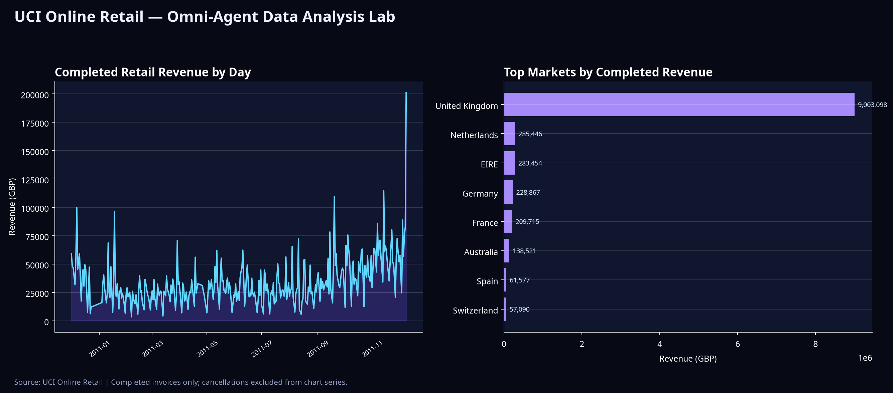

# اختبار حي مفصل: UCI Online Retail مع Omni-Agent

## نطاق الاختبار

اختُبر **Data Analysis Lab** والتوأم الاستراتيجي محلياً على ملف `online_retail.csv` بحجم **45.81MB**. جرى تحويله دون تغيير السجلات من ملف `Online Retail.xlsx` الرسمي الصادر عن UCI. تصف UCI المصدر بأنه بيانات معاملات لمتجر تجزئة بريطاني غير تقليدي خلال الفترة من ديسمبر 2010 إلى ديسمبر 2011، ويحتوي على **541,909** سجل معاملات وثمانية حقول تشمل الفاتورة والكمية والسعر والعميل والدولة [1].

> هذه النتائج هي مخرجات حسابات محلية من النسخة التي اختُبرت. وهي دليل على عمل المحرك وليست توصية استثمارية أو تقديراً مالياً لشركة حقيقية.

## نتائج Data Analysis Lab

| المؤشر | النتيجة |
| --- | ---: |
| الصفوف التي حُللت | 541,909 |
| الأعمدة | 8 |
| زمن تشغيل التحليل عبر API | 2.50 ثانية |
| درجة جودة البيانات | 97/100 — ممتازة |
| الخلايا الناقصة | 136,534 |
| نسبة القيم الناقصة | 3.15% |
| الصفوف المكررة | 5,268 |
| نسبة التكرار | 0.97% |
| معدل القيم الشاذة العددي | 6.04% |
| الوكلاء المكتملون | 4: Profiling وInsight وQuality وSales Intelligence |

اكتشف وكيل المبيعات حقلي `Quantity` و`UnitPrice` تلقائياً، وحسب قيمة السطر بالصيغة `Quantity × UnitPrice`. وصل صافي القيمة بعد احتساب الإلغاءات إلى **9,747,747.93**، بينما بلغت قيمة المعاملات المكتملة قبل أثر الإلغاءات **10,644,560.42**. رصد النظام **22,064** طلباً مكتملاً و**4,339** عميلاً فريداً، مع متوسط قيمة طلب محسوب قدره **482.44**.

| مؤشر المعاملات | النتيجة |
| --- | ---: |
| صفوف الإلغاء | 9,288 |
| أثر الإلغاءات المالي | -896,812.49 |
| أكبر سوق حسب مبيعات المعاملات المكتملة | United Kingdom — 9,003,097.96 |
| أكبر سوقين بعد المملكة المتحدة | Netherlands — 285,446.34؛ EIRE — 283,453.96 |
| أعلى منتج غير تشغيلي في القيمة | REGENCY CAKESTAND 3 TIER — 174,484.74 |

### القراءة الصحيحة للنتائج

يكشف المخطط الزمني عن تذبذب ملموس في إيراد المعاملات المكتملة وارتفاع في نهاية الفترة. ويهيمن سوق المملكة المتحدة على الإيراد، لذلك لا يصح افتراض أن الاستنتاجات قابلة للتعميم على الأسواق الأصغر من دون تقسيم إضافي. كما أن الحقول الناقصة تتركز في `CustomerID` و`Description`، وتوجد معاملات إلغاء وقيم شاذة؛ لذلك لا تستخدم المتوسطات الخام أو إجمالي المبيعات وحده كقرار نهائي.

## نتيجة دورة التوأم الاستراتيجي

أُدخل الهدف التالي إلى التوأم:

> تقييم تجربة توسع تجاري محدودة مع مراقبة الإلغاءات وقيمة الطلبات في أسواق التجزئة.

أنشأ النظام مسودة قرار `decision_36369ae917a9` في **2.48 ثانية**. في التشغيل الأول لم توجد سابقة دلالية للمستخدم الاختباري، ولذلك أعطى التوأم **83/100** كمؤشر ثقة وأوصى بتجربة محدودة قابلة للقياس لا بتوسع واسع. كانت فجوات الدليل واضحة: غياب سابقة معتمدة، ووجود 9,288 صف إلغاء ينبغي مراقبة أثره.

في اختبار التعلم المحكوم، أُرسلت **موافقة اختبارية صريحة** على المسودة المحلية بغرض التحقق من الكود، وليست قراراً تشغيلياً حقيقياً. تحولت المسودة إلى الحالة `approved_and_learned`، وخُزنت كسجل دلالي `mem_4d2e39a3c6d0`. عند إعادة تشغيل الهدف نفسه، استرجع التوأم **سابقة واحدة** وارتفع مؤشر الثقة إلى **88/100**، مع بقاء المسودة الجديدة في حالة `pending_human_review`.

| خاصية الحوكمة | ما أثبته الاختبار |
| --- | --- |
| لا تعلّم دون موافقة | لم يُكتب قرار دلالي في التشغيل الأول |
| تعلّم بعد اعتماد صريح | أصبح القرار المعتمد سابقة قابلة للاسترجاع |
| لا تنفيذ خارجي | بقيت النتيجة توصية ومسودة، ولم تُجر أي عملية خارج API المحلي |
| شفافية الثقة | تغير المؤشر من 83 إلى 88 بعد وجود سابقة، وليس إلى اعتماد تلقائي |

## ما الذي يضيفه هذا للمشروع؟

أصبح Omni-Agent قادراً على الانتقال من تحليل CSV عام إلى دورة قرار قابلة للمراجعة: بيانات جديدة، وسوابق مرتبطة، وخطة تحقق، ومؤشر ثقة، وموافقة بشرية، ثم ذاكرة دلالية منظمة. عند الربط الإنتاجي مع PostgreSQL/pgvector، تتوسع الذاكرة لتضم قرارات وتقارير ومؤشرات المؤسسة مع عزل بيانات كل مستخدم أو مؤسسة.

## References

[1]: https://archive.ics.uci.edu/dataset/352/online+retail "UCI Machine Learning Repository — Online Retail"
